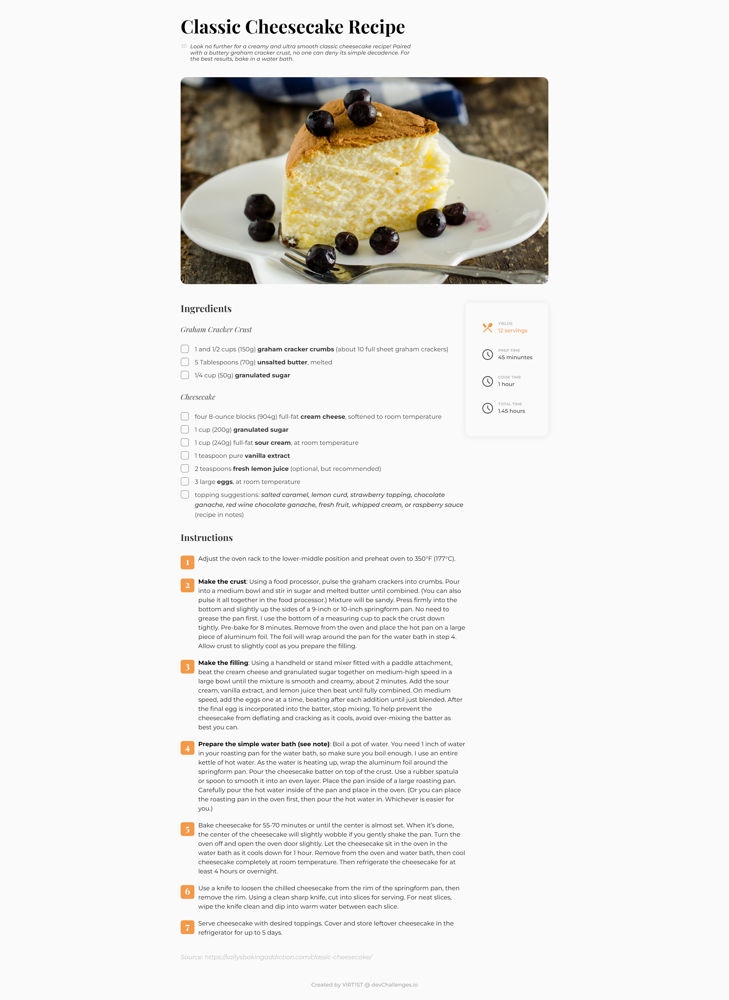

<h1 align="center">CHALLENGE #04: RECIPE PAGE</h1>   

   Solution for a challenge from  <a href="http://devchallenges.io" target="_blank">Devchallenges.io</a>.

  <h3>
    <a href="https://virt1st.github.io/devchallenges-recipe-page/">Demo</a>
     | 
    <a href="https://devchallenges.io/challenges/OEKdUZ6xs0h99C38XVht">Challenge</a>
  </h3>

## Screenshot

## Built With

-   HTML
-   CSS
-   BEM
-   SCSS
